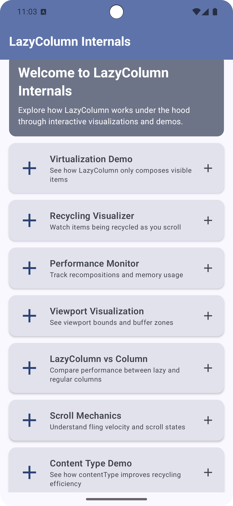
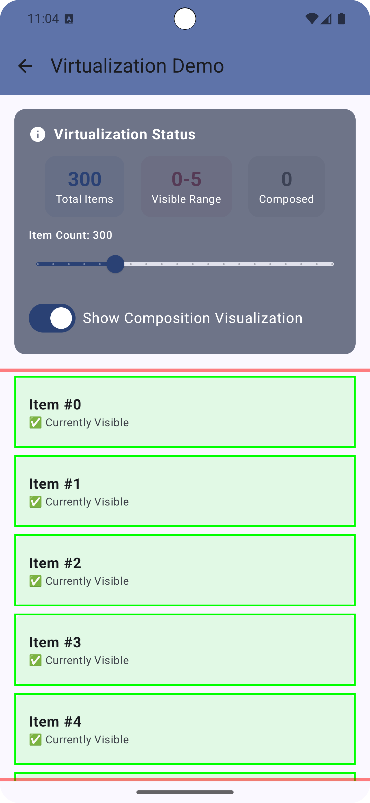
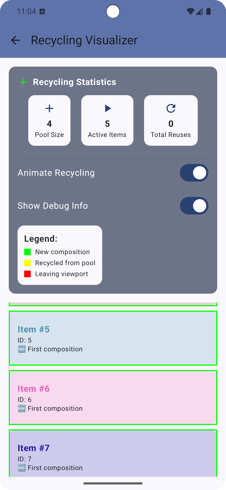
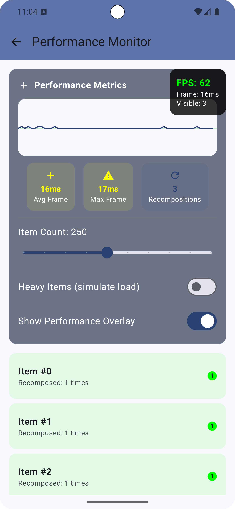
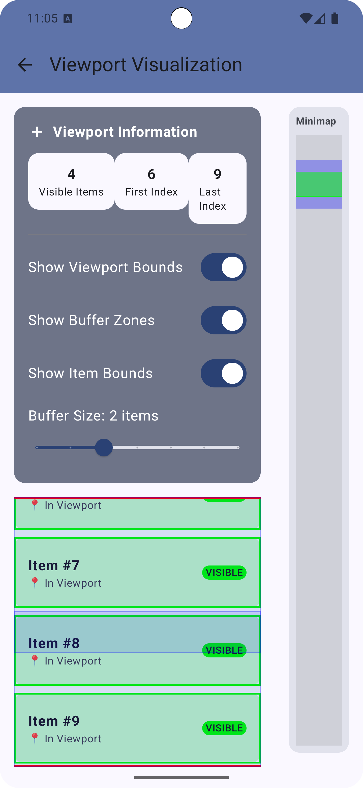
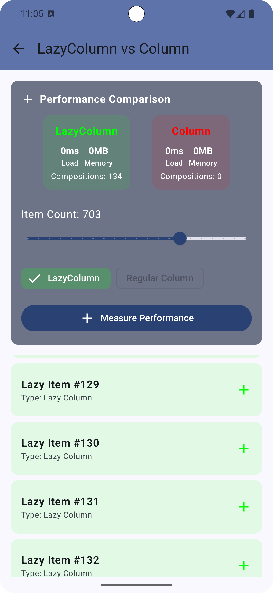
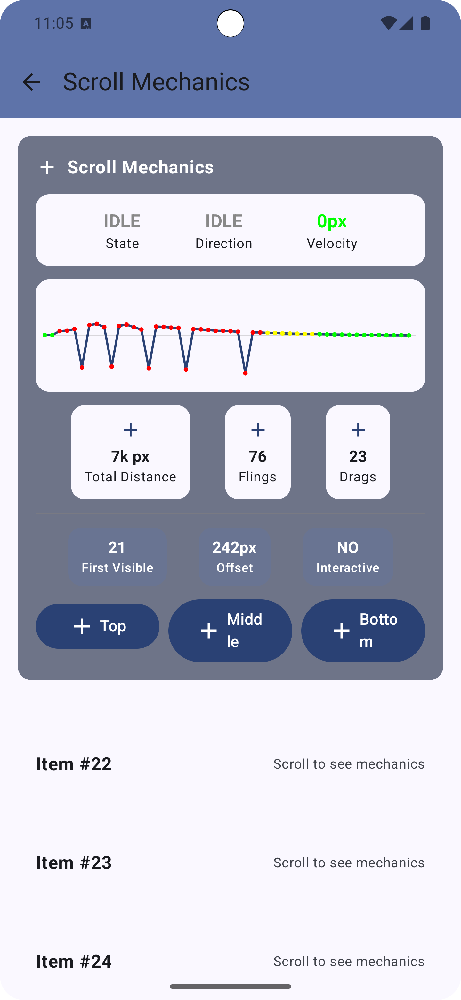
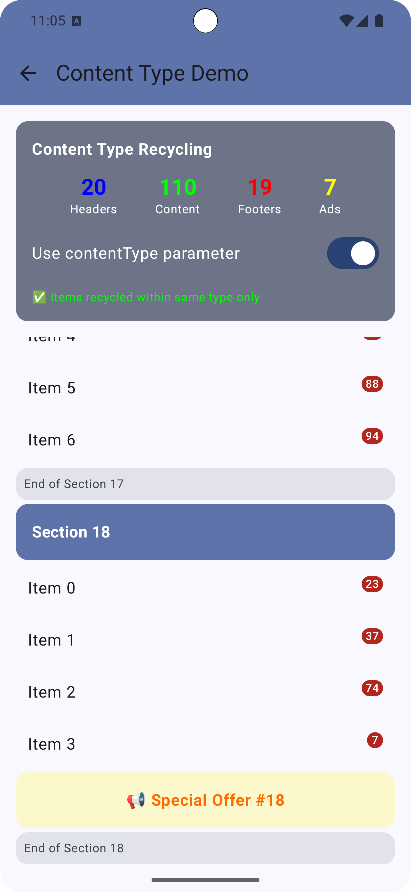

# LazyColumn Internals Visualizer

An educational Android app that demonstrates and visualizes how LazyColumn works under the hood in Jetpack Compose.

## Table of Contents

- [Overview](#overview)
- [Screenshots](#screenshots)
- [Features](#features)
- [Tech Stack](#tech-stack)
- [Project Structure](#project-structure)
- [Getting Started](#getting-started)
- [Key Concepts](#key-concepts)
- [Code Examples](#code-examples)
- [Use Cases](#use-cases)
- [License](#license)

## Overview

Understanding how `LazyColumn` works internally is crucial for building performant Android apps with Jetpack Compose. This app provides interactive visualizations that make abstract concepts tangible and easy to grasp.

## Screenshots

### Home Screen


The main navigation hub featuring 7 interactive demos. Each card provides quick access to different aspects of LazyColumn's internal workings, from virtualization to scroll mechanics.

---

### Virtualization Demo


Demonstrates how LazyColumn only composes visible items. Key features:
- **Total Items**: Shows the full list size (300 items in this example)
- **Visible Range**: Displays which items are currently in viewport (0-5)
- **Composed Count**: Real-time count of actually composed items
- **Green borders**: Indicate currently visible items
- **Adjustable slider**: Change item count from 50 to 1000 to see scalability

This demo proves that even with hundreds of items, only a handful are actually composed at any time.

---

### Recycling Visualizer


Watch the recycling mechanism in action as you scroll. Features include:
- **Pool Size**: Number of disposed compositions ready for reuse
- **Active Items**: Currently composed items in viewport
- **Total Reuses**: Counter showing how many times items have been recycled
- **Color-coded legend**:
  - Green = New composition (first time)
  - Yellow = Recycled from pool
  - Red = Leaving viewport
- **Animated transitions**: Visual feedback when items enter/leave composition

---

### Performance Monitor


Real-time performance metrics dashboard showing:
- **FPS Counter**: Live frames per second (62 FPS shown)
- **Frame Time**: Current frame duration (16ms target for 60fps)
- **Visible Count**: Number of items in viewport
- **Avg Frame**: Average frame rendering time
- **Max Frame**: Worst frame time detected
- **Recompositions**: Total recomposition count
- **Heavy Items toggle**: Simulate expensive item rendering
- **Per-item recomposition badges**: Track how many times each item recomposes

---

### Viewport Visualization


Visualize the viewport boundaries and buffer zones:
- **Visible Items**: Count of items in viewport (4)
- **First/Last Index**: Boundary indices (6-9)
- **Minimap**: Visual representation of scroll position within the full list
- **Viewport Bounds toggle**: Show/hide viewport boundary markers
- **Buffer Zones toggle**: Visualize pre-composition buffer areas
- **Item Bounds toggle**: Display individual item boundaries
- **Buffer Size slider**: Adjust how many items are pre-composed outside viewport

The minimap on the right shows current position (green) within the entire scrollable content.

---

### LazyColumn vs Column Comparison


Side-by-side performance comparison between LazyColumn and regular Column:
- **Load Time**: Time to compose the list
- **Memory**: Memory footprint comparison
- **Compositions**: Number of items composed
  - LazyColumn: 134 compositions (only visible items)
  - Column: 0 shown (would compose ALL 703 items at once)
- **Item Count slider**: Adjust list size to see performance impact
- **Measure Performance button**: Run benchmark comparison

This demo clearly shows why LazyColumn is essential for large lists.

---

### Scroll Mechanics


Deep dive into scroll physics and gesture handling:
- **State**: Current scroll state (IDLE, DRAGGING, FLINGING)
- **Direction**: Scroll direction indicator
- **Velocity**: Real-time scroll velocity in pixels
- **Velocity Graph**: Visual representation of scroll speed over time
- **Total Distance**: Cumulative scroll distance (7k px)
- **Flings**: Count of fling gestures detected (76)
- **Drags**: Count of drag gestures (23)
- **First Visible/Offset**: Precise scroll position info
- **Quick navigation buttons**: Jump to Top, Middle, or Bottom

The velocity graph shows the characteristic spike pattern of fling gestures (red/yellow peaks) vs steady drag scrolling (green baseline).

---

### Content Type Demo


Demonstrates how `contentType` parameter optimizes recycling for heterogeneous lists:
- **Item type breakdown**: Headers (20), Content (110), Footers (19), Ads (7)
- **contentType toggle**: Enable/disable type-based recycling
- **Visual indicators**: Different styling for each content type
  - Section headers (purple background)
  - Regular items (white with badges)
  - Special offers/Ads (yellow highlight)
- **Recycling efficiency message**: "Items recycled within same type only"

When enabled, items are only recycled within their own type, preventing expensive recompositions when a header slot is reused for content.

## Features

### 1. Virtualization Demo
- Shows how LazyColumn only composes visible items
- Real-time tracking of composed vs non-composed items
- Visual indicators for items in viewport
- Adjustable item count (50-1000) to demonstrate scalability

### 2. Recycling Visualizer
- Watch items being recycled as you scroll
- Color-coded visualization of new vs recycled items
- Statistics tracking for pool size and reuse count
- Animated transitions when items enter/leave composition

### 3. Performance Monitor
- Real-time frame rate monitoring
- Recomposition counter per item
- Memory usage tracking
- Performance comparison with heavy vs light items
- Live FPS overlay

### 4. Viewport Visualization
- Visual representation of viewport boundaries
- Buffer zone demonstration
- Minimap showing scroll position
- Item state tracking (visible, buffer, outside)

### 5. LazyColumn vs Column Comparison
- Side-by-side performance comparison
- Memory usage analysis
- Load time measurements
- Demonstration of why LazyColumn is more efficient for large lists

### 6. Scroll Mechanics
- Fling velocity visualization
- Scroll state monitoring
- Real-time velocity graph
- Differentiation between drag and fling gestures

### 7. Content Type Demo
- Shows how `contentType` improves recycling efficiency
- Demonstrates heterogeneous list optimization
- Visual comparison of typed vs untyped recycling

## Tech Stack

| Technology | Version | Purpose |
|------------|---------|---------|
| Kotlin | 1.9.x | Programming language |
| Jetpack Compose | BOM | UI framework |
| Material 3 | Latest | Design system |
| Navigation Compose | 2.7.7 | Screen navigation |
| Compose Runtime Tracing | 1.0.0-beta01 | Performance monitoring |

**SDK Requirements:**
- Min SDK: 24 (Android 7.0)
- Target SDK: 35
- Compile SDK: 35

## Project Structure

```
app/src/main/java/com/example/myapplication/
├── MainActivity.kt                     # App entry point with edge-to-edge support
├── navigation/
│   └── AppNavigation.kt                # NavHost with 7 screen routes
├── screens/
│   ├── HomeScreen.kt                   # Main menu with demo cards
│   ├── VirtualizationDemoScreen.kt     # Composition tracking demo
│   ├── RecyclingVisualizerScreen.kt    # Item recycling visualization
│   ├── PerformanceMonitorScreen.kt     # FPS and memory tracking
│   ├── ViewportVisualizationScreen.kt  # Viewport bounds demo
│   ├── ComparisonDemoScreen.kt         # LazyColumn vs Column
│   ├── ScrollMechanicsScreen.kt        # Scroll physics demo
│   └── ContentTypeDemo.kt              # Content type optimization
└── ui/theme/
    ├── Color.kt                        # Color definitions
    ├── Theme.kt                        # Material 3 theme setup
    └── Type.kt                         # Typography definitions
```

## Getting Started

### Prerequisites

- Android Studio Hedgehog (2023.1.1) or later
- JDK 8 or higher
- Android device/emulator running API 24+

### Installation

1. **Clone the repository**
   ```bash
   git clone <repository-url>
   cd android-lazy-column
   ```

2. **Open in Android Studio**
   - File > Open > Select the project directory

3. **Sync Gradle**
   - Android Studio will prompt to sync automatically
   - Or manually: File > Sync Project with Gradle Files

4. **Run the app**
   ```bash
   ./gradlew assembleDebug
   ./gradlew installDebug
   ```
   Or use the Run button in Android Studio.

## Key Concepts

### Virtualization
`LazyColumn` only composes items visible in the viewport, dramatically reducing memory usage for large lists.

```
Total Items: 1000
Composed Items: ~15 (only visible ones)
Memory Saved: ~98%
```

### Item Recycling
When items scroll out of view, their slot compositions are disposed and reused for new items entering the viewport.

### Keys for Stability
Using stable keys helps Compose track items across recompositions:

```kotlin
LazyColumn {
    items(
        items = list,
        key = { item -> item.id }  // Stable identifier
    ) { item ->
        ItemComposable(item)
    }
}
```

### Content Types
Group similar items for more efficient recycling:

```kotlin
LazyColumn {
    items(
        items = mixedList,
        contentType = { item -> item.type }  // "header", "content", "footer"
    ) { item ->
        when (item) {
            is Header -> HeaderItem(item)
            is Content -> ContentItem(item)
            is Footer -> FooterItem(item)
        }
    }
}
```

## Code Examples

### Tracking Visible Items

```kotlin
val listState = rememberLazyListState()

// Get visible item indices
val visibleItems = listState.layoutInfo.visibleItemsInfo.map { it.index }

// First and last visible
val firstVisible = listState.firstVisibleItemIndex
val lastVisible = listState.layoutInfo.visibleItemsInfo.lastOrNull()?.index
```

### Monitoring Composition

```kotlin
@Composable
fun TrackedItem(index: Int, onComposed: () -> Unit) {
    LaunchedEffect(Unit) {
        onComposed()  // Called when item enters composition
    }

    DisposableEffect(Unit) {
        onDispose {
            // Called when item leaves composition
        }
    }

    // Item content...
}
```

### Scroll State Observation

```kotlin
val listState = rememberLazyListState()

// Observe scroll state
val isScrolling = listState.isScrollInProgress
val canScrollForward = listState.canScrollForward
val canScrollBackward = listState.canScrollBackward
```

## Use Cases

- **Learning**: Understand Compose lazy list internals
- **Teaching**: Visual aids for presentations and workshops
- **Debugging**: Diagnose scroll and performance issues
- **Optimization**: Learn best practices for list performance
- **Portfolio**: Demonstrate Android/Compose expertise

## Technical Highlights

- **Composition Tracking**: Each demo tracks when items are composed and disposed
- **Performance Metrics**: Real-time monitoring of frame times and recompositions
- **Visual Feedback**: Color coding and animations to make concepts tangible
- **Interactive Controls**: Sliders, switches, and buttons for experimentation

## License

This project is created for educational purposes and portfolio demonstration.